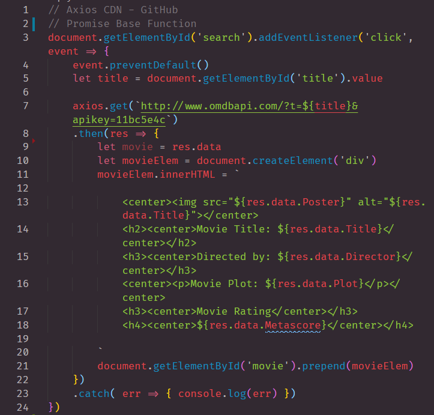

# axiosMovieApp
## utilizing AXIOS request to gather information from an Movie API

> In this repository we created a movie app that is powered by JavaScript and uses the AXIOS method request to OMDBAPI.com. 

## What is an AXIOS request? 

```
    - AXIOS request is requesting information from an API
    - GIVEN a user wants to find a movie
    - THEN the user can search for the movie by 'Title'
    - GIVEN the correct 'Title'
    - THEN the movie's info will display 

```

***Figure One***



## HOME PAGE


## LINKS

- [jQueryAJAX Link](https://nicholasd-uci.github.io/axiosMovieApp/)
- [Github Repo Link](https://github.com/nicholasd-uci/axiosMovieApp)
- [Nicholas Dallas GitHub](https://github.com/nicholasd-uci)

- - -
© 2020 NPRD, Nicholas Paul Ruiz Dallas